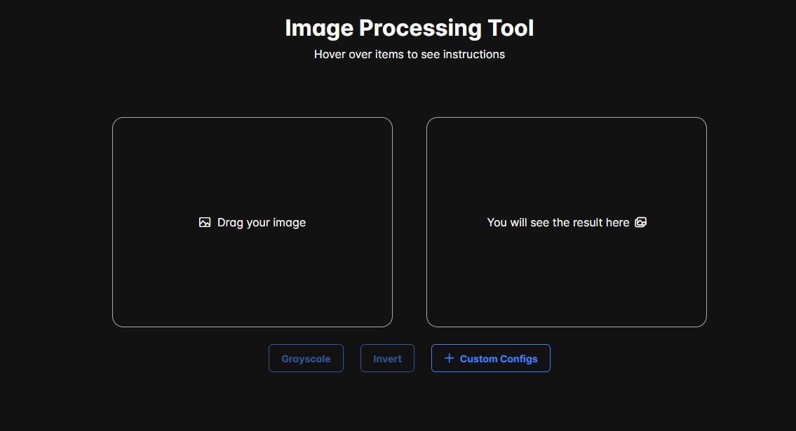
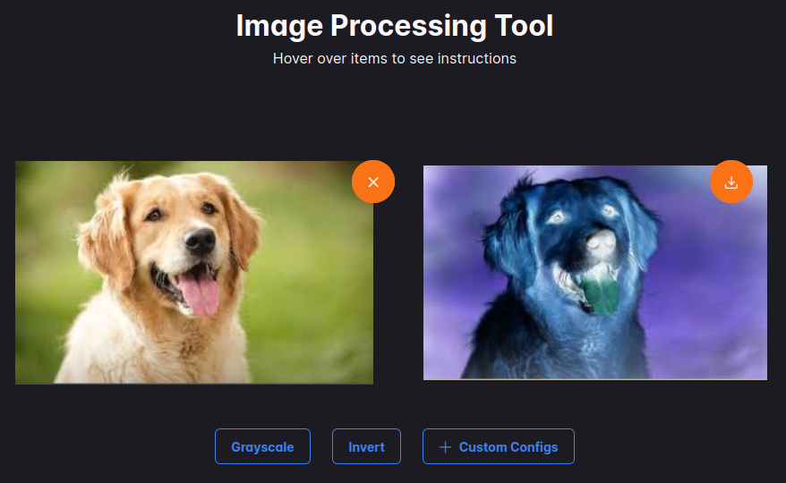

# Image Processing Tool

This project provides a user interface for interacting with the Image Processing API, enabling users to perform various image processing tasks.

## Project Overview

The Image Processing Tool UI is an Angular application that integrates with a Flask-based API for image processing tasks such as color replacement, grayscale conversion, and color inversion. The application offers an intuitive frontend to interact with the backend services.

## Getting Started

The Tool is available [here](https://image-processing-tool-frontend.web.app/).

View of the tool:

In this example, image inversion is performed:

## FrontEnd

The frontend of the Image Processing Tool is developed by [ Sergey Arzumanyan ](https://github.com/SergeyArzumanyan). This part of the project leverages the Angular framework to create a responsive and user-friendly interface that integrates seamlessly with the Flask-based API for image processing.

### Key Features

- **Interactive UI:** Designed for ease of use, providing a smooth user experience for image processing tasks.
- **Real-Time Updates:** Reflects changes instantly with Angular's data binding and component-based architecture.
- **Responsive Design:** Ensures compatibility with various screen sizes and devices.

### Technologies Used

- **Angular CLI:** The project was generated and managed using Angular CLI version 18.1.3.
- **HTML/CSS:** For structuring and styling the web pages.
- **JavaScript/TypeScript:** Utilized for dynamic content and type-safe coding.
- **Bootstrap/Material Design:** For responsive and modern UI components (if applicable).

The frontend communicates with the backend API to handle image processing requests, including tasks such as color replacement, grayscale conversion, and color inversion.

For development, the frontend application can be run locally using `npm run start`, and it will automatically reload with any source file changes. For production, the project is built and deployed automatically from the `dist` folder to hosting when changes are pushed to the `front` branch.

## BackEnd

The backend of the Image Processing Tool is developed using Flask and is responsible for handling image processing tasks. This part of the project provides a robust API for performing operations such as color replacement, grayscale conversion, and color inversion.

### Key Features

- **API Endpoints:** Provides RESTful endpoints for various image processing tasks.
- **Scalability:** Designed to handle multiple concurrent requests efficiently.
- **Integration:** Seamlessly integrates with the Angular frontend to deliver processed images.

### Technologies Used

- **Python:** The programming language used for backend development.
- **Flask:** A lightweight WSGI web application framework used to build the API.
- **Pillow:** Utilized for image processing tasks including color manipulation and transformation.
- **Gunicorn:** WSGI HTTP server used to serve the Flask application.

## Contact

- For any questions related to the FrontEnd, please contact [Sergey Arzumanyan](mailto:sergey.arzumanyan.work@gmail.com).
- For any questions related to the BackEnd, please contact [Robert Arustamyan](mailto:robertarustamyan2@gmail.com).
